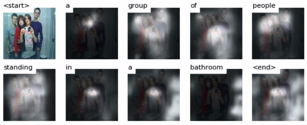
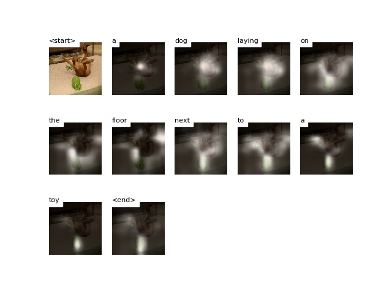

# Image Captioning

To explore the fascinating intersections between **computer vision** and **natural language processing**, I implemented the image captioning model in [Show, Attend and Tell](https://arxiv.org/abs/1502.03044) with [some tweaks](#Key-Info). 

For a bit of history, the encoder-decoder model proved their worth in machine translation tasks so researchers started using it for translating image features into language in a similar way. However, the biggest difference between translating the extracted features of an image and a French sentence both to an English sentence is that the visual information need to be heavily compressed into a just few bytes. Therefore, to build an image captioning model with the encoder-decoder model, the attention algorithm that lets the neural network "focus" on parts of the image when outputting each word is the key to higher performance. 

In this project, I learned a lot about integrating feature extraction with attention and LSTM, the underlying math equations from papers, and using PyTorch framework. Below is are results of my trained model (30 of them in `output`). 

---

## Background

From [Show, Attend and Tell](https://arxiv.org/abs/1502.03044):
> Automatically generating captions of an image is a task very close to the heart of scene understanding - one of the primary goals of computer vision.

Neural image captioning is about giving machines the ability of compressing salient visual information into descriptive language. The biggest challenges are building the bridge between computer vision and natural language processing models and producing captions that described the most significant aspects of the image.

For detailed background info on feature extraction, soft/hard self-attention, and sequence generation with LSTM, [resources section](#Resources) contains a number of useful links/papers I used. Wrapping my head around how image encoding, attention, and LSTM come together led me to understanding this implementation (top-down approach). 

---

## Key Info

Below are some of my choices about the implementation (chronological order).

- **PyTorch** both for its pythonic syntax and to utilize the strong GPU acceleration. There is less documentation on PyTorch so I ended up learning a lot more by reading some source code
- **Colab's T4 GPU** from google (thank you!), which was strong enough for Flickr30k with small batch sizes (max 12)
- **Flickr30k** dataset because MS COCO requires enormous training time and computational power for Colab. [Link to download](http://cs.stanford.edu/people/karpathy/deepimagesent/caption_datasets.zip) from Andrej Karpathy. He also clarified why there is a 'restval' split in [this tweet](https://twitter.com/karpathy/status/592193801310973952)
- **No pre-trained embedding** because training my own embedding is not so computationally expensive and fits to context
- **Soft attention** (deterministic) for its differentiability (simple standard backprop). Intuitively, soft attention looks at the whole image while focusing on some parts while hard attention only looks at one randomly weighted choice at a time
- **Mult-layer perceptron** for the attention model, as from [the paper](https://arxiv.org/abs/1502.03044)
- **Doubly stochastic attention regularization parameter** was used to encourage the model to pay equal attention to every part of the image over a course of generation. This was used to improve the score in [the paper](https://arxiv.org/abs/1502.03044).
- **Early stopping** to terminate training if the BLEU score did not improve for 10 epochs, the best model checkpoint would be saved
- **BLEU-4** score for both training (early stopping) and evaluation
- **Beam Search** to find the most optimal sequence after decoder does the heavy lifting

---

## Performance

For beam size of 4, my [final model](https://drive.google.com/drive/folders/1fovpJ_MhVVQiq2c-BAHiAKCPLogh-kf5?usp=sharing) reached 32.83 BLEU score.

---

## Dependencies

NumPy, os, json, h5py, PyTorch, matplotlib, Pillow, scikit-image, SciPy, Jupyter Notebook/Google Colab, tqdm.

---

## Possible Improvements

- Better hardware enables the use of MS COCO, higher batch size, higher epoch
- Try hard-attention and compare performances
- Fine-tune ResNet longer to fit the dataset
- Perform image augmentation (ie. horizontal flip) ie MS COCO is still not enough (unlikely)
- Instead of constant teacher forcing, [scheduled sampling](https://arxiv.org/pdf/1506.03099.pdf) has been proven to be better based on probability.
- As mentioned in [the paper](https://arxiv.org/abs/1502.03044), a major drawback of using attention is distilling the important parts of an image especially on images that have a lot of things going on. This problem is addressed by [DenseCap](https://cs.stanford.edu/people/karpathy/densecap/) where the objects are first recognized in separate windows. 

---

## Files 
<pre>
README.md            - self

assets               - images for README
input                - input images
output               - output alphas and sentences

train.ipynb          - Colab notebook for training model
evaluation.ipynb     - Colab notebook for evaluating model (BLEU score)

caption.py           - the class for input data
models.py            - encoder, attention, and decoder models
organize_input.py    - script for parsing raw input data into json files
visualize_result.py  - script for testing model and producing results 
</pre>

---

## Resources

#### Papers

- [Show, Attend and Tell: Neural Image Caption Generation with Visual Attention](https://arxiv.org/abs/1502.03044)
- [Fully Convolutional Localization Networks for Dense Captioning](https://cs.stanford.edu/people/karpathy/densecap/)
- [Deep Residual Learning for Image Recognition](https://arxiv.org/abs/1512.03385)
- [Scheduled Sampling for Sequence Prediction with Recurrent Neural Networks](https://arxiv.org/pdf/1506.03099.pdf)

#### Miscellaneous

- [Pytorch documentation](https://pytorch.org/docs/stable/index.html)
- [Colab documentation](https://colab.research.google.com/notebooks/welcome.ipynb#recent=true)
- [List of related repositories](https://github.com/zhjohnchan/awesome-image-captioning)
- [Blog Tutorial on Image captioning without attention](https://www.analyticsvidhya.com/blog/2018/04/solving-an-image-captioning-task-using-deep-learning/)
- [Github Tutorial on image captioning with attention](https://github.com/sgrvinod/a-PyTorch-Tutorial-to-Image-Captioning#caption-lengths)
- [Attention video explanation + a bit of image captioning](https://www.youtube.com/watch?v=W2rWgXJBZhU)
